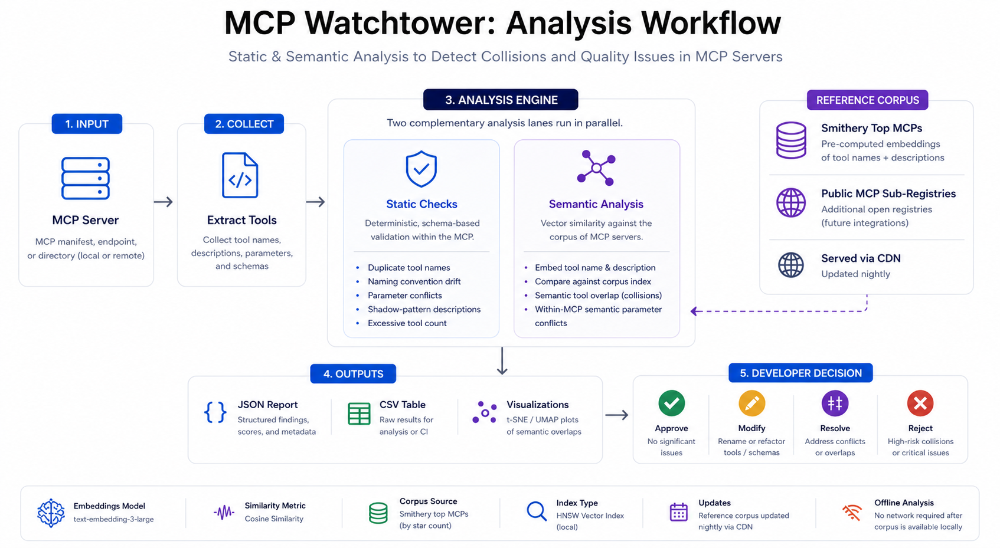

# mcp-watchtower

Analyze MCP servers for naming, routing, and semantic tool conflicts.


**Docs:** https://self-5d39fc87.mintlify.app/

## Overview



> Figure: MCP Watchtower performs static validation and semantic comparison against a continuously updated MCP corpus to detect collisions and quality issues.

`mcp-watchtower` analyzes an MCP server (local, remote, or manifest) and produces two types of findings:

## Quick start

```bash
npx mcp-watchtower scan --server "uvx my-server"
```

By default, a scan runs both the deterministic static checks and the deeper semantic analysis pass.

Human-readable scans now stream the current tool name and any findings as they are discovered, include phase headers, and repeat the findings in the final report. `--json` keeps output machine-readable by emitting only the final JSON payload.

## Learn more

- [Get started](https://self-5d39fc87.mintlify.app/introduction)
- [CLI reference](https://self-5d39fc87.mintlify.app/cli/scan)
- [Checks overview](https://self-5d39fc87.mintlify.app/checks/overview)
- [API reference](https://self-5d39fc87.mintlify.app/api/overview)

## CLI Usage

```bash
# Local MCP server over stdio
npx mcp-watchtower scan --server "uvx my-server"

# Remote MCP endpoint without auth
npx mcp-watchtower scan --remote "https://api.example.com/mcp"

# Remote MCP endpoint with bearer auth
npx mcp-watchtower scan --remote "https://api.example.com/mcp" --auth-token "$MCP_TOKEN"

# Manifest / CI input
npx mcp-watchtower scan --manifest ./tools.json --name my-server
```

### Useful flags

```bash
# JSON output
npx mcp-watchtower scan --server "uvx my-server" --json

# Treat static name collisions as critical
npx mcp-watchtower scan --server "uvx my-server" --platform

# Syntactic-only scan
npx mcp-watchtower scan --server "uvx my-server" --syntactic

# Semantic-only scan
npx mcp-watchtower scan --server "uvx my-server" --semantic

# Expanded human-readable logging
npx mcp-watchtower scan --server "uvx my-server" --verbose

# Tune semantic sensitivity
npx mcp-watchtower scan --server "uvx my-server" --threshold 0.8
```

`--auth-token` is optional for `--remote` and is only needed when the endpoint requires bearer authentication.

## What it checks

### Static analysis

- duplicate tool names
- inconsistent naming conventions
- conflicting parameter names for the same concept
- prompt-shadowing language in tool descriptions
- excessive tool counts

### Semantic analysis

- `ALREADY_IN_CORPUS` — the tool appears to already exist in the corpus
- `SEMANTIC_OVERLAP` — the tool looks close to an existing tool and may need clearer disambiguation
- `SEMANTIC_PARAMETER_CONFLICT` — two parameters in the same server look semantically equivalent despite inconsistent names

Plain `scan` runs both layers. Use `--syntactic` for only the deterministic checks or `--semantic` for only the deeper semantic pass.

## Exit codes

- `0` — no critical static findings
- `1` — one or more critical static findings

Semantic findings are informational or warning-level only and do **not** affect the exit code.

## Index behavior

Semantic analysis ships with a bundled fallback index in `src/data/`.

On CLI startup, `mcp-watchtower` also checks the published CDN manifest and, if a newer index is available, downloads it to:

```text
~/.mcp-watchtower/index/
```

If the CDN is unavailable or the update fails, scans continue silently with the bundled index.

## Programmatic usage

```ts
import { SemanticAnalyzer, StaticAnalyzer } from 'mcp-watchtower'

const staticReport = new StaticAnalyzer().analyze('my-server', tools)
const semanticReport = await new SemanticAnalyzer().analyze('my-server', tools)
```

## Development

```bash
npm run build
npm test
npm run pack:check
npm run crawl
npm run embed
npm run build-index
npm run publish-index
```

If you're working from a local clone instead of npm, build first and run the compiled CLI directly:

```bash
npm install
npm run build
node dist/cli/index.js scan --server "uvx my-server"
```

`publish-index` rebuilds the corpus, embeddings, and semantic index, then uploads the refreshed assets and manifest to Cloudflare R2. The nightly GitHub Actions workflow at `.github/workflows/refresh-index.yml` runs the same publish step automatically.

## Releasing the package

`mcp-watchtower` should be released with Changesets, separate from the semantic index refresh pipeline.

1. Add a changeset in the same PR as any user-visible package change:

   ```bash
   npm run changeset
   ```

2. Merge the PR into `main`.
3. The `release.yml` workflow will open or update a `chore: release package` PR with the version bump and changelog changes.
4. Merge that release PR to publish the package to npm and create the matching GitHub Release.

### Release requirements

- Repository secret: `NPM_TOKEN` with permission to publish `mcp-watchtower`
- Built-in `GITHUB_TOKEN` handles the release PR, tags, and GitHub Release creation

### When to add a changeset

- Add a normal changeset for any user-visible change to behavior, CLI flags, shipped assets, or public library APIs.
- If a PR should merge without producing a release, run:

  ```bash
  npx changeset --empty
  ```

  That records intentional "no release" work so reviewers and automation do not have to guess.

### Local release validation

Before publishing manually or debugging the workflow locally, validate the release artifact with:

```bash
npm run build
npm test
npm run pack:check
```

### If a release fails

- If the workflow fails before publishing to npm, fix the issue on `main`; the release PR will be regenerated or updated automatically.
- If npm publish fails because of auth or registry configuration, fix `NPM_TOKEN` or package permissions and rerun the workflow.
- If a version was tagged but npm did not receive the package, inspect the failed Actions logs before retrying so you do not attempt to republish an existing version.

## Semantic index releases

The semantic index is intentionally released on its own cadence. `.github/workflows/refresh-index.yml` continues to rebuild and publish the Cloudflare R2 assets independently of npm package releases.
